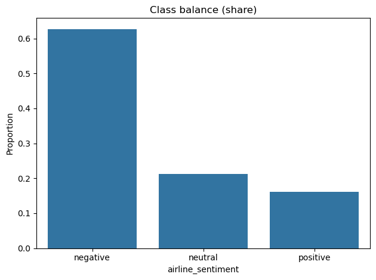
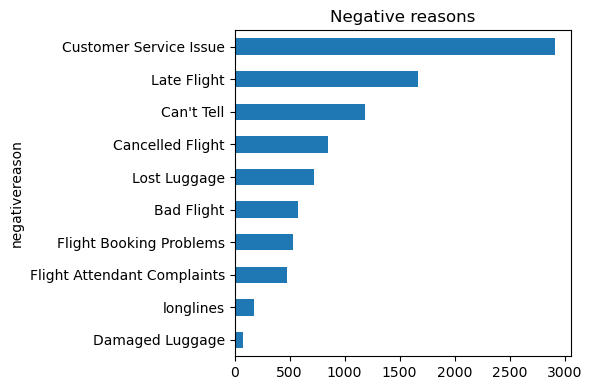
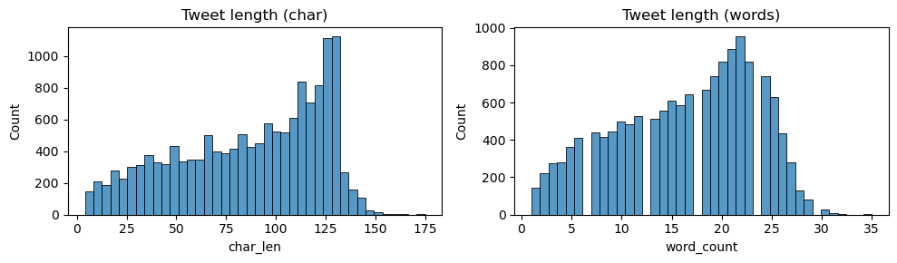
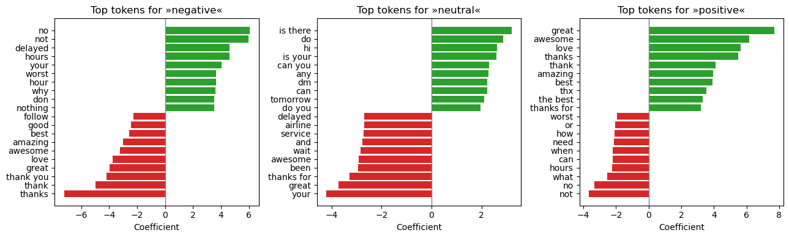
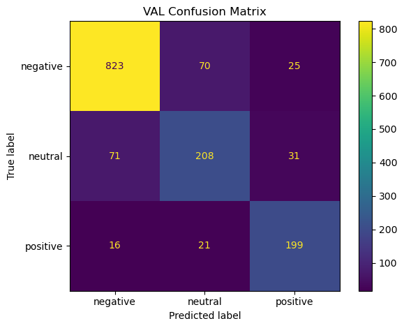
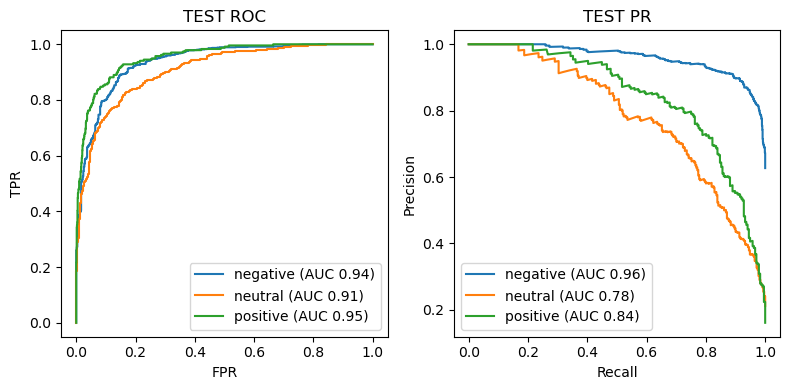
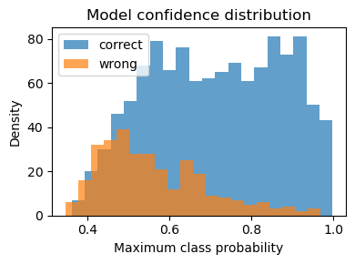

# Final Report 

This project predicts tweet sentiment (negative, neutral, positive) for U.S. airlines to speed up customer‑care triage. Two production‑ready models run end‑to‑end: a tuned **TF‑IDF + Logistic Regression** baseline and a fine‑tuned **DistilBERT** transformer. On a held‑out test set, DistilBERT reaches **~0.84 accuracy / ~0.79 macro‑F1**; the tuned classical model delivers **~0.79 accuracy / ~0.74 macro‑F1**. DistilBERT reduces the error rate by **~24%** vs. the classical baseline.

## Data
14,640 tweets (Feb 2015). Labels are imbalanced (≈63% negative, 21% neutral, 16% positive). Use stratified 80/10/10 splits and class weighting. Typical tweets fit within 128 tokens.

## Approach
1) **Classical baseline** — bigram TF‑IDF + Logistic Regression.  
2) **Transformer** — fine‑tuned DistilBERT with max length 128, 2 epochs, batch 16, LR 2e‑5.

## Results (held‑out test)
- **Majority baseline:** ~0.63 accuracy.  
- **TF‑IDF + LogReg (tuned):** ~0.79 accuracy, ~0.74 macro‑F1, macro ROC‑AUC ~0.91.  
- **DistilBERT (fine‑tuned):** ~0.84 accuracy, ~0.79 macro‑F1.  

Key patterns:
- Main confusion flow: **negative ↔ neutral**. Positive remains distinct.
- Confidence distribution: most errors sit in the **0.40–0.70** band; **≥0.80** predictions are reliable.
- ROC/PR: clean separation for negative and positive; neutral is hardest.

## Productization
- **Inference:** single‑file CLI and a **FastAPI** micro‑service (`/predict`).  
- **Packaging:** **Dockerfile** (Python 3.11‑slim) for one‑command run.  
- **CI/CD:** GitHub Actions (lint → tests → image build; optional push on tags).  
- **Reproducibility:** versioned artifacts for data, models, and metrics.

[Visual: CLI example + FastAPI `/predict` example]
[Visual: Dockerfile snippet + CI workflow snippet]

## Suggested operating policy
- **Auto‑route** when max class probability **≥ 0.80**.  
- **Human‑review** when **0.50–0.79**.  
- **Monitor** score distributions, confusion‑matrix drift, and calibration in production.

## Next steps
- Apply **temperature scaling** for tighter probability calibration.  
- Collect more **neutral** examples; test class‑weighted or focal loss.  
- Explore a domain‑specific LM (e.g., TweetEval‑style) if neutral recall remains a pain point.
